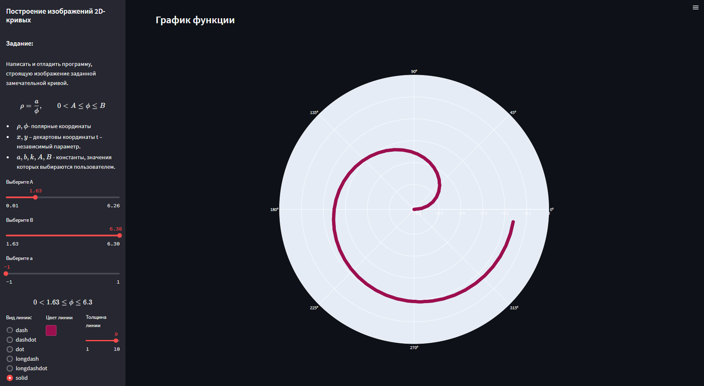
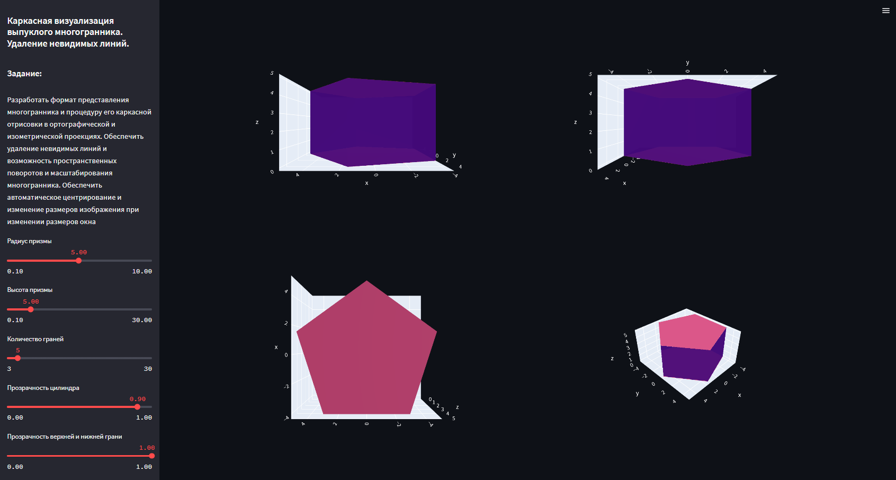
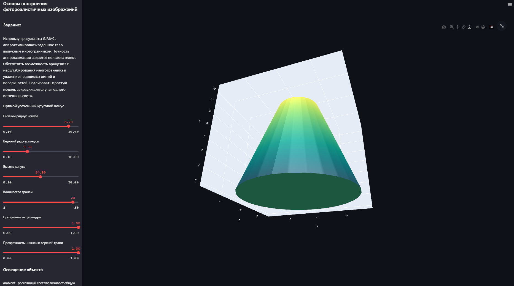
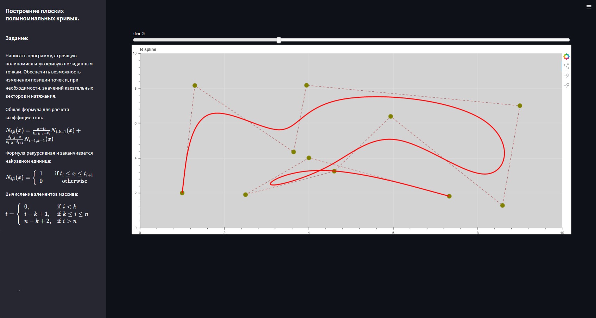

# cg-streamlit

Лабораторные работы по дисциплине компьютерная графика, выполненные с помощью [Streamlit](https://streamlit.io/)


## Включает файлы
```bash
|-- README.md
|-- app
|   |-- Dockerfile
|   |-- labs
|   |   |-- __init__.py
|   |   |-- polynomial_curves.py
|   |   |-- spheric_coordinates.py
|   |   `-- wireframe_vis.py
|   |-- main.py
|   |-- requirements.txt
|   `-- utils
|       |-- __init__.py
|       |-- plot.py
|       |-- src
|       |   `-- b_s_callback.js
|       `-- st_utils.py
`-- docker-compose.yaml
```

### Запуск
Перед запуском убедитесь, что в системе установлен `docker` и `docker-compose` коомандами:

```bash
sudo docker --version
sudo docker-compose --version
```

Далее проверьте, запущен ли демон `docker`
```bash
sudo docker ps
```

Тогда можно поднимать сервис

```bash
docker run -p 8080:8080 danil2286/cg-streamlit
```

---

## Лабораторная работа № 1
Тема: Построение изображений 2D- кривых.

Задание: Написать и отладить программу, строящую изображение заданной замечательной кривой

$$ ρ = {a\overϕ}, \qquad 0 < A \leq ϕ \leq B$$

* $ρ,ϕ$- полярные координаты
* $x,y$ – декартовы координаты t – независимый параметр
* $a,b, k,A,B$ - константы, значения которых выбираются пользователем



---

## Лабораторная работа № 2
Тема:  Каркасная визуализация выпуклого многогранника. Удаление невидимых линий

Задание: Разработать формат представления многогранника и процедуру его каркасной отрисовки в ортографической и
изометрической проекциях. Обеспечить удаление невидимых линий и возможность пространственных поворотов и
масштабирования многогранника. Обеспечить автоматическое центрирование и изменение размеров изображения при
изменении размеров окна



---
## Лабораторная работа № 3-5
Тема: Основы построения фотореалистичных изображений

Задание: Используя результаты Л.Р.№2, аппроксимировать заданное тело выпуклым многогранником. Точность
аппроксимации задается пользователем. Обеспечить возможность вращения и масштабирования многогранника и
удаление невидимых линий и поверхностей. Реализовать простую модель закраски для случая одного источника света.
Параметры освещения и отражающие свойства материала задаются пользователем в диалоговом режиме.



---

## Лабораторная работа № 6
Тема: Создание анимационных эффектов

Задание: Для поверхности, созданной в прощлой ЛР, обеспечить выполнение эффекта изменения
интенсивности источника рассеянного света


---

## Лабораторная работа № 7
Тема: Построение плоских полиномиальных кривых

Задание: Написать программу, строящую полиномиальную кривую по заданным точкам. Обеспечить возможность
изменения позиции точек и, при необходимости, значений касательных векторов и натяжения.

Общая формула для расчета коэффициентов:

$$N_{i,k}(x)=\frac{x-t_i}{t_{i+k-1}-t_i}N_{i,k-1}(x)+\frac{t_{i+k}-x}{t_{i+k}-t_{i+1}}N_{i+1,k-1}(x)$$


